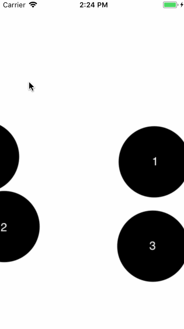

# BLBubbleFilters [](#installation) [](#license)

[](#installation)
[](https://cocoapods.org/pods/BLBubbleFilters)
[](https://github.com/Carthage/Carthage)
[](http://twitter.com/BellAppLab)




BLBubbleFilters gives you bubble filters à la Apple Music.

Inspired by: [SIFloatingCollection_Swift](https://github.com/ProudOfZiggy/SIFloatingCollection_Swift)

## Specs

* SpriteKit
* iOS 9+
* tvOS 9+

## Usage

The starting point of using `BLBubbleFilters` is the `BLBubbleScene` class. We begin by initialising one:

```objc
- (void)viewWillAppear:(BOOL)animated
{
    [super viewWillAppear:animated];
    
    BLBubbleScene *scene = [BLBubbleScene sceneWithSize:CGSizeMake(self.view.bounds.size.width / 2.0, self.view.bounds.size.height / 2.0)];
    scene.backgroundColor = [UIColor whiteColor];
    scene.bubbleDataSource = <#code#>;
    scene.bubbleDelegate = <#code#>;

    [(SKView *)self.view presentScene:scene];
}
```

**Notes**:
1. We highly recommend initialising a `BLBubbleScene` on `viewWillAppear:` so it gets correctly adjusted to the screen size.
2. The example above assumes your view controller's `view` is a `SKView`.

### Scene data source

You must provide the `BLBubbleScene` with a data source conforming to the `BLBubbleSceneDataSource` protocol. Its two required methods are:

```objc
//provides the scene with the number of bubbles to present
- (NSInteger)numberOfBubblesInBubbleScene:(BLBubbleScene *)scene {
    return <#code#>;
}
```

And:

```objc
- (id<BLBubbleModel>)bubbleScene:(BLBubbleScene *)scene
           modelForBubbleAtIndex:(NSInteger)index
{
    return <#code#>;
}
```

The `BLBubbleModel` protocol provides a bubble with some of the visual information it needs to draw itself.

### Scene delegate

You may set the scene's `delegate`, if you'd like to be notified when a bubble is selected:

```objc
- (void)bubbleScene:(BLBubbleScene *)scene
    didSelectBubble:(BLBubbleNode *)bubble
            atIndex:(NSInteger)index
{
    //a bubble has been tapped
}
```

## Example

A typical implementation of `BLBubbleFilters` looks like this:

```objc
#import "ViewController.h"
#import <BLBubbleFilters/BLBubbleFilters.h>
#import "Bubble.h"


@interface ViewController () <BLBubbleSceneDataSource, BLBubbleSceneDelegate>

@property (nonatomic, strong) NSArray<Bubble *> *bubbles;

@end


@implementation ViewController

- (void)viewDidLoad
{
    [super viewDidLoad];
    
    [self setBubbles:@[[[Bubble alloc] initWithIndex:0],
                       [[Bubble alloc] initWithIndex:1],
                       [[Bubble alloc] initWithIndex:2],
                       [[Bubble alloc] initWithIndex:3]]];
}

- (void)viewWillAppear:(BOOL)animated
{
    [super viewWillAppear:animated];
    
    BLBubbleScene *scene = [BLBubbleScene sceneWithSize:self.view.bounds.size];
    scene.backgroundColor = [UIColor whiteColor];
    scene.bubbleDataSource = self;
    scene.bubbleDelegate = self;

    [(SKView *)self.view presentScene:scene];
}

#pragma mark Bubble Delegate

- (void)bubbleScene:(BLBubbleScene *)scene
    didSelectBubble:(BLBubbleNode *)bubble
            atIndex:(NSInteger)index
{
    NSLog(@"Bubble Pressed! %@", bubble);
    NSLog(@"The bubble is now on state %ld", (long)[bubble.model bubbleState]);
}

#pragma mark Bubble Data Source

- (NSInteger)numberOfBubblesInBubbleScene:(BLBubbleScene *)scene
{
    return self.bubbles.count;
}

- (id<BLBubbleModel>)bubbleScene:(BLBubbleScene *)scene
           modelForBubbleAtIndex:(NSInteger)index
{
    return [self.bubbles objectAtIndex:index];
}

@end

```

_**Note**: Implementation of the `Bubble` Data Model is up to you. ;)_

## Requirements

* iOS 8+
* Obj-C
* SpriteKit

## Installation

### Cocoapods

```ruby
pod 'BLBubbleFilters', '~> 1.0'
```

Then `#import <BLBubbleFilters/BLBubbleFilters.h>` where needed.

### Carthage

```objc
github "BellAppLab/BLBubbleFilters" ~> 1.0
```

Then `#import <BLBubbleFilters/BLBubbleFilters.h>` where needed.

### Git Submodules

```shell
cd toYourProjectsFolder
git submodule add -b submodule --name BLBubbleFilters https://github.com/BellAppLab/BLBubbleFilters.git
```

Then drag the `BLBubbleFilters` folder into your Xcode project.

## Author

Bell App Lab, apps@bellapplab.com

### Credits

[Logo image](https://thenounproject.com/search/?q=bubble&i=1118287#) by [Jaohuarye](https://thenounproject.com/jaohuarye) from [The Noun Project](https://thenounproject.com/)

## License

BLBubbleFilters is available under the MIT license. See the LICENSE file for more info.
